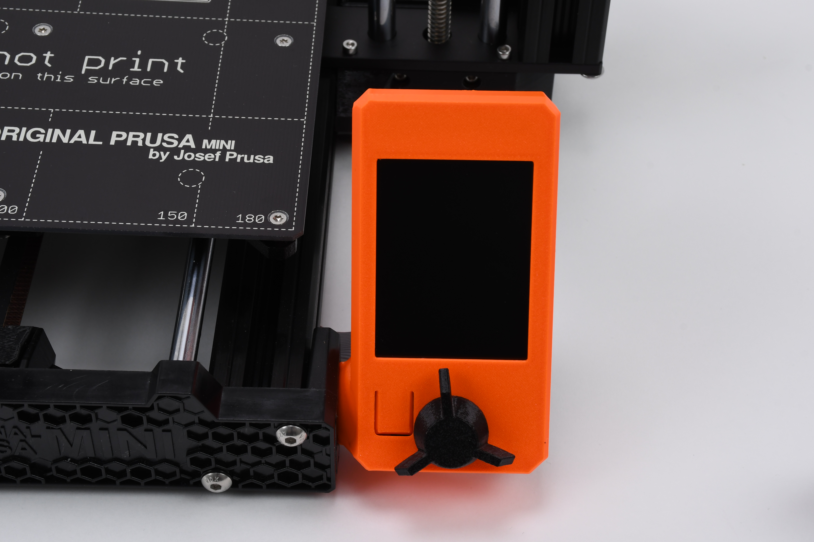
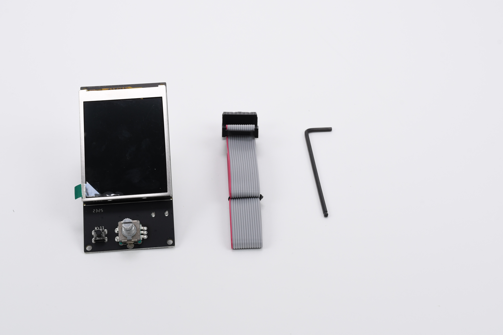

# Replacing the display and LCD cable in your Prusa MINI

It might happen that your MINI printer's display stops working. There are many reasons why the display could stop working. For example, the display or the cable might get mechanically damaged. When the display stops working, the easiest fix is to replace the display and the cable to be able to continue using your Prusa MINI printer.

<figure><figcaption></figcaption></figure>

To replace the display and the LCD cable, you will have to go through the following steps:

1. Remove the old display.
2. Insert the new display in the LCD enclosure.
3. Mount the display back on the printer.
4. Get access to the other side of the LCD cable.
5. Replace the old LCD cable.
6. Reconnect all loosened and removed parts.
7. Test if the new display works.

For the steps above, you will need:

<table data-header-hidden data-full-width="false"><thead><tr><th width="300"></th><th></th></tr></thead><tbody><tr><td><ul><li>new LCD display</li><li>new LCD cable</li><li>2.5 mm Allen key</li></ul></td><td>

<figure><figcaption></figcaption></figure>
</td></tr></tbody></table>

Let's continue with the first step, [removing the old display](prusa-research/replacing-lcd-screen-and-lcd-cable-in-your-prusa-mini/removing-the-old-lcd-display.md).
