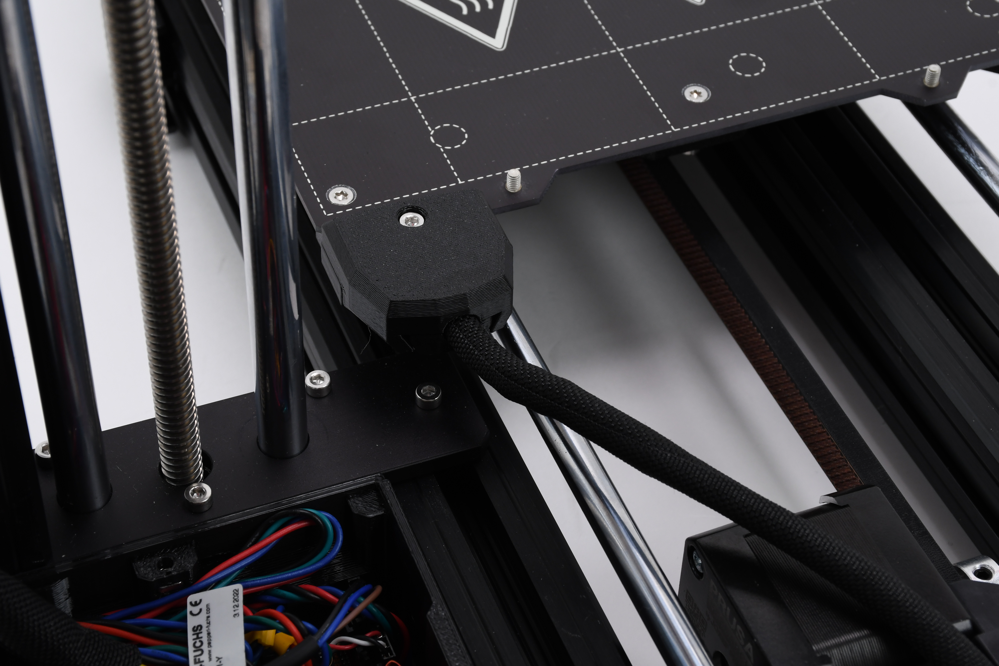
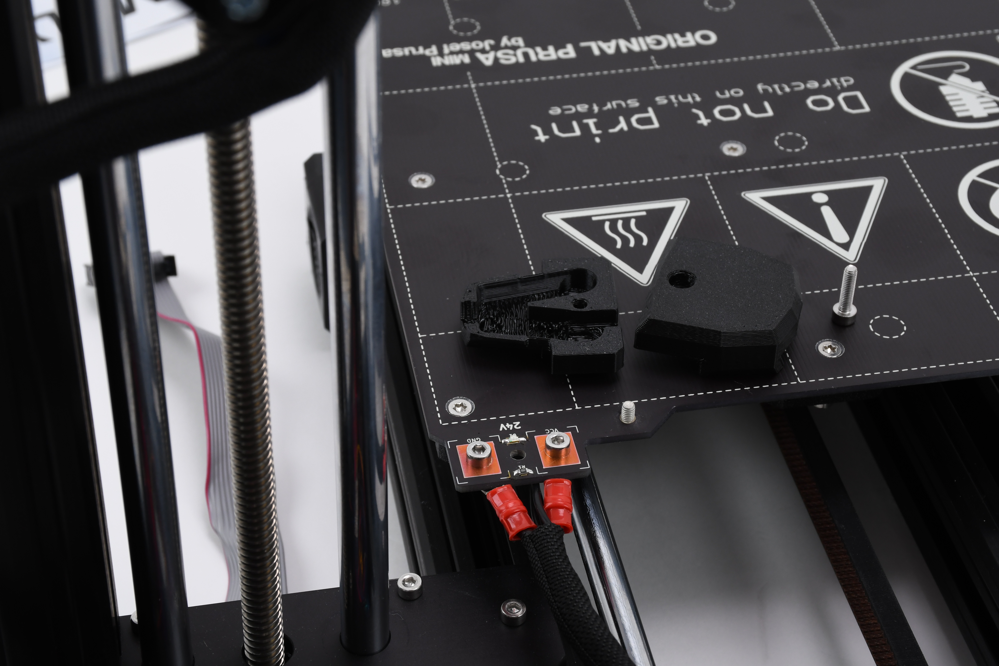
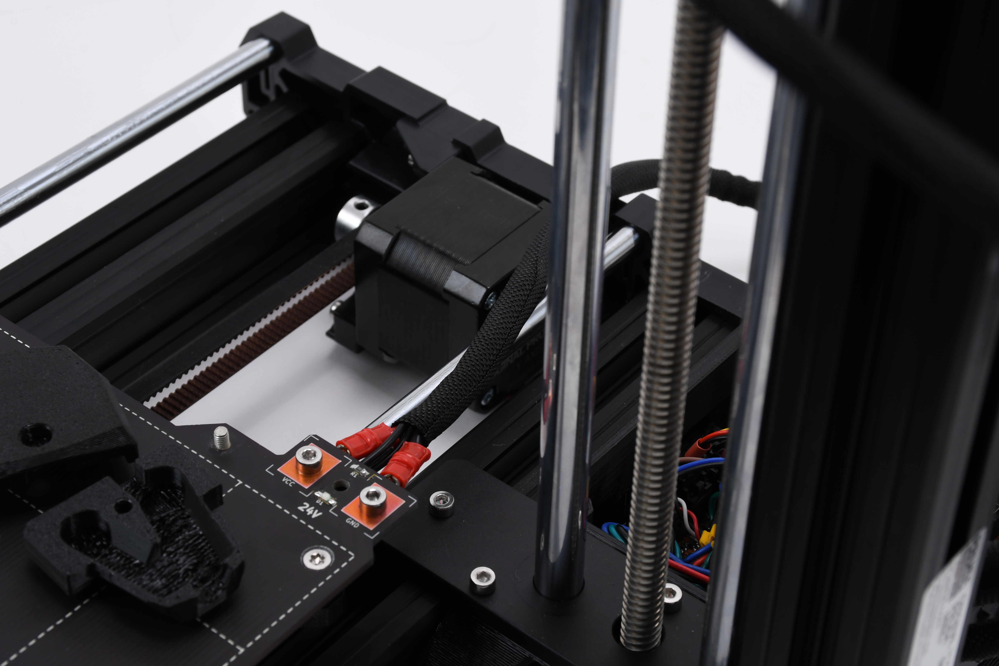
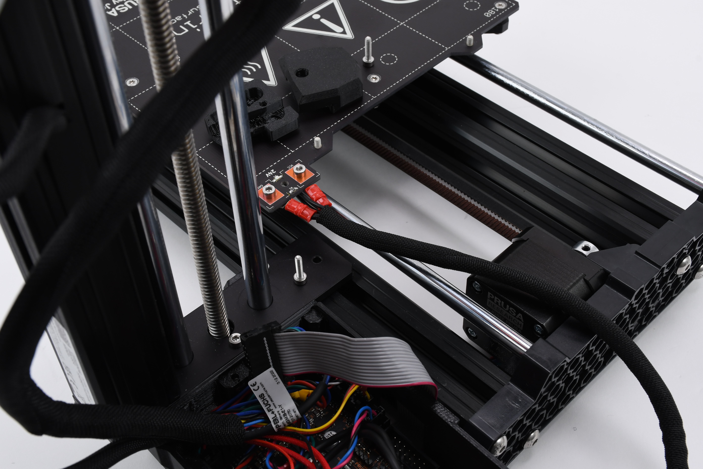

# Get access to the cable

* Loosen the screws holding the electronics enclosure.

<figure><figcaption></figcaption></figure>


Tilt the printer carefully to reach the second screw easier.


* Remove the heatbed cable covers to get better access to the screw at the top of the steel plate.

| 

<figure><figcaption></figcaption></figure>
 | 

<figure><figcaption></figcaption></figure>
 |
| ----------------------------------------------------------------------------------------------------------------- | ----------------------------------------------------------------------------------------------------------------- |

* Remove the steel plate screw.

| 

<figure><figcaption></figcaption></figure>
 | 

<figure><figcaption></figcaption></figure>
 |
| ----------------------------------------------------------------------------------------------------------------- | ----------------------------------------------------------------------------------------------------------------- |

* Remove the top of the electronics enclosure.

<figure><figcaption></figcaption></figure>

You should now have easy access to the LCD cable. Let's replace the cable in the next step.
