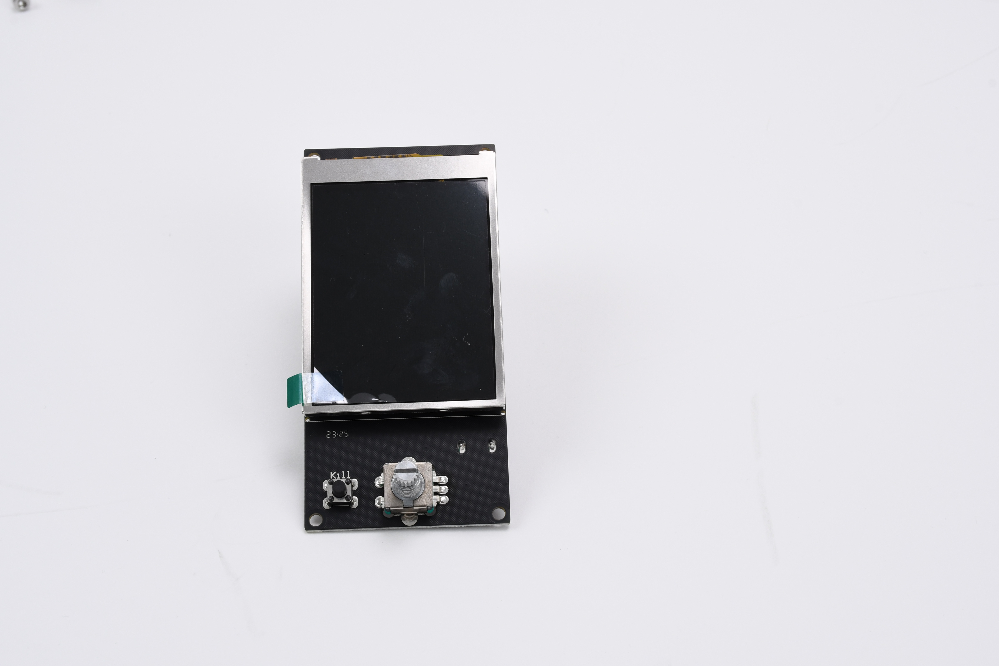
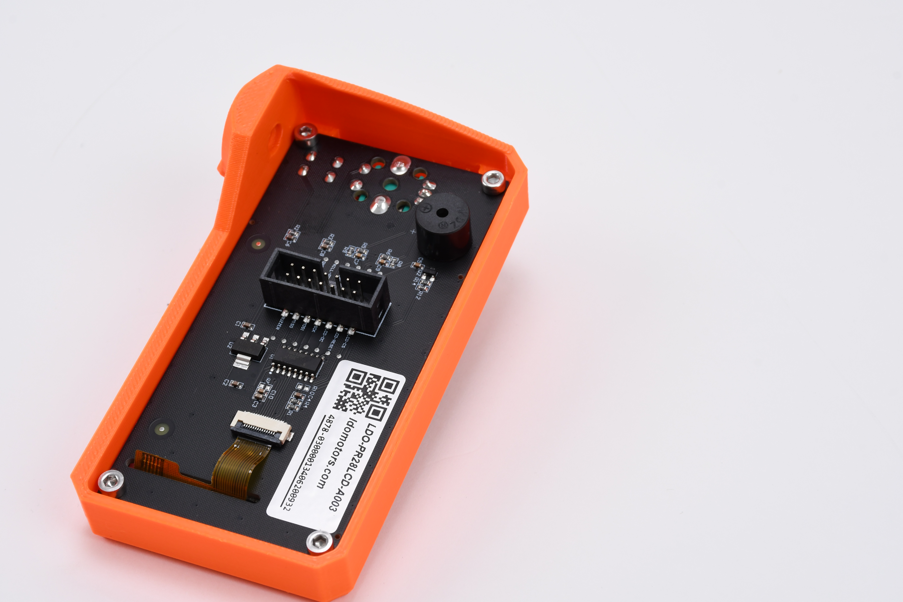

# Insert the new display

* Take the new display and remove the protective foil. Note the green strip on the foil to remove the foil easily.

<figure><figcaption></figcaption></figure>

* Put the new display into the LCD enclosure and secure it in place with the M3x12 screws.

<figure><figcaption></figcaption></figure>


Tighten the screws in a zig-zag order to prevent twisting the LCD board.


* Put back the selection knob on the front side of the LCD enclosure. Push on the knob gently and rotate clockwise. Leave some slack to allow rotating the knob.

You have put the new display in the LCD enclosure. Before replacing the LCD cable, you need to get access to the other end of the old LCD cable. Continue to the next page.
