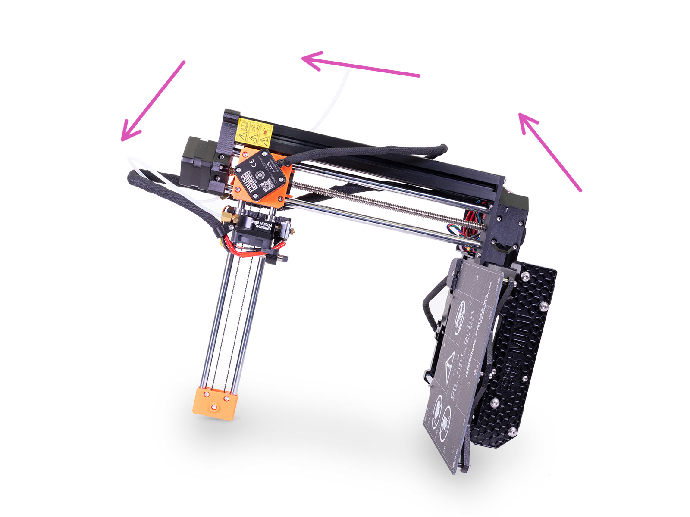
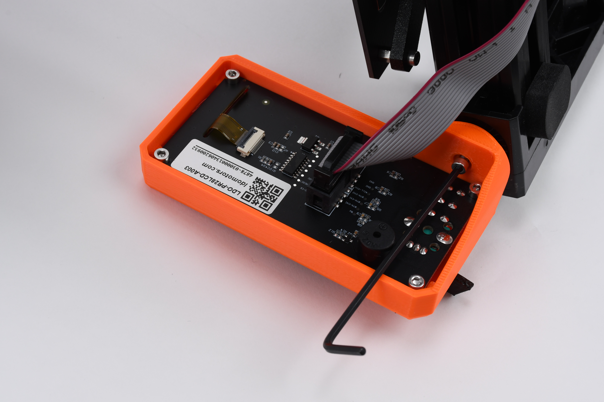
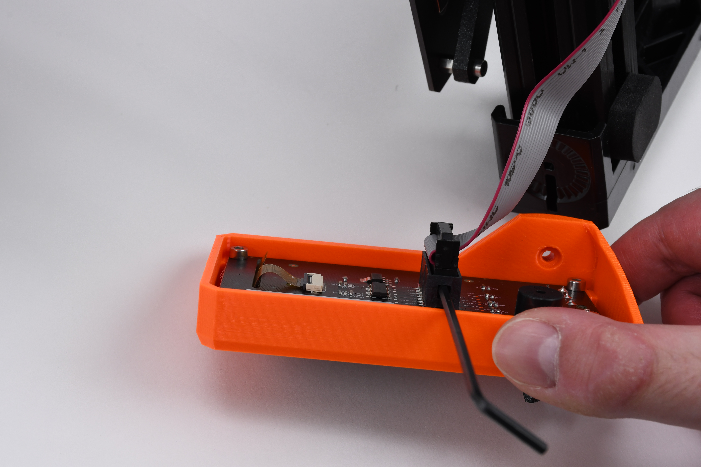
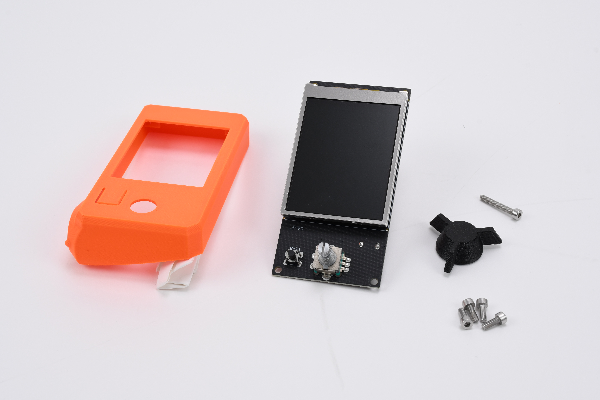

# Remove the old display

* Carefully tilt the printer to the side to reach the back of the LCD enclosure.

<figure><figcaption></figcaption></figure>

* Remove the screw holding the display in place.

<figure><figcaption></figcaption></figure>


If it's difficult to loosen the screw, flip the Allen key to use the longer end as leverage. When the screw is loose, switch back to the shorter end.&#x20;


* Unplug the old LCD cable. If the LCD cable is holding tight, you can use the Allen key to carefully pry it out.

<figure><figcaption></figcaption></figure>

* Remove the selection knob from the LCD enclosure. Pull on the knob gently and rotate counter-clockwise until the knob comes off.
* Remove the screws holding the old display.

When you remove the old display, you should have the following components:

<table data-header-hidden><thead><tr><th width="300" valign="middle"></th><th valign="top"></th></tr></thead><tbody><tr><td valign="middle"><ul><li>LCD enclosure</li><li>old LCD display</li><li>selection knob</li><li>1x M3X20 screw</li><li>4x M312 screws</li></ul></td><td valign="top">

<figure><figcaption></figcaption></figure>
</td></tr></tbody></table>

In the next step, you will insert the new display into the LCD enclosure.
