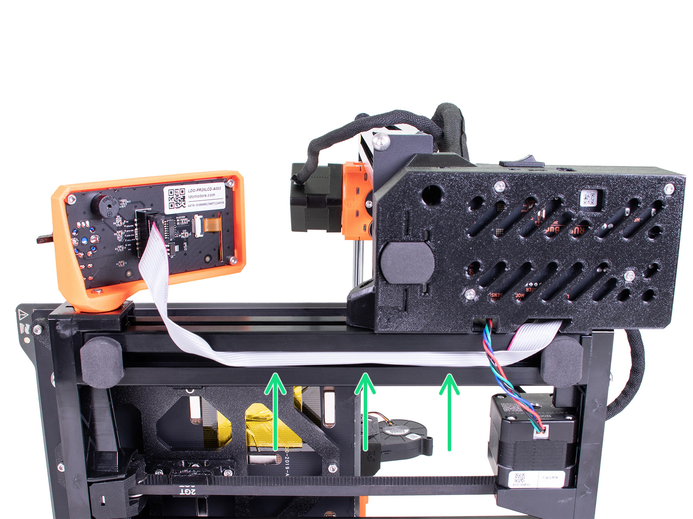

# Replace the old LCD cable

* Move the electronics enclosure slightly so you can pull out the LCD cable.

<figure><figcaption></figcaption></figure>

* Plug the new LCD cable into the LCD enclosure. Guide the LCD cable through the bottom of the printer into the electronics enclosure.

<figure><figcaption></figcaption></figure>


To insert the cable in the extrusion, carefully bend it into two halves along its length.


You have replaced the old display and LCD cable with new components. In the next step, you plug in the LCD cable and put back any removed or loose screws.
