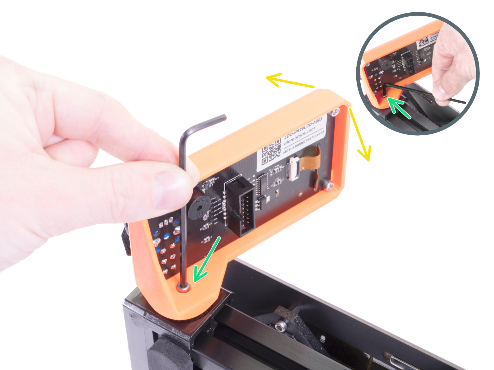

# Mount the new display

* Carefully tilt the printer the same way as you did when removing the old display.

<figure><figcaption></figcaption></figure>

* Mount the new display on the 3D printer.

<figure><figcaption></figcaption></figure>


You can change the angle at which you mount the display anytime.


After mounting the display, you can replace the LCD cable. First, you need to get access to the cable in the next step.
