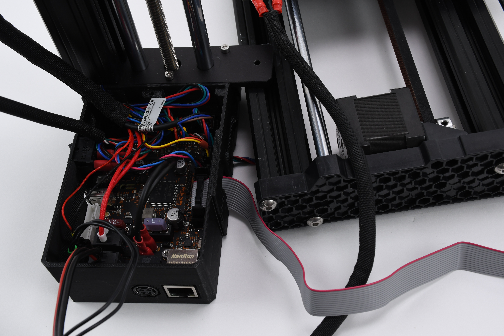

# Plug in the new LCD cable

* Move the electronics enclosure slightly so you can pull out the old LCD cable.

<figure><figcaption></figcaption></figure>

* Plug the new LCD cable into the electronics enclosure in place of the old LCD cable.
* Guide the LCD cable through the bottom of the printer into the electronics enclosure. Connect the new LCD cable to the LCD display.&#x20;

<figure><figcaption></figcaption></figure>


To insert the cable in the extrusion, carefully bend it into two halves along its length.&#x20;


You have replaced the old display and LCD cable with new components. In the next step, you put back any removed or loosened screws.
