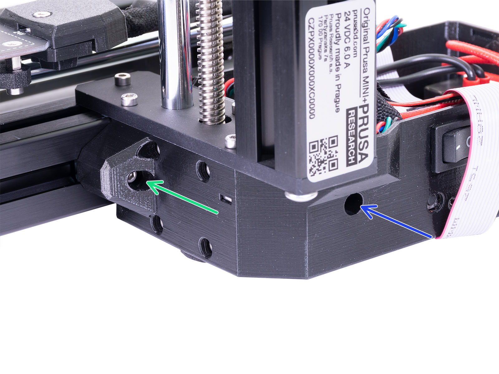

# Reconnect all moved parts

* Put back the heatbed cable guard.
* Connect the electronics enclosure and the heatbed steel plate. Align the heatbed edge with the cutout on the electronics enclosure. Make sure that the M3x12 screw goes through the M3nE nut.

| 

<figure><figcaption></figcaption></figure>
 | 

<figure><figcaption></figcaption></figure>
 |
| ----------------------------------------------------------------------------------------------------------------- | ---------------------------------------------------------------------------------------------------------------------------------- |

* Tighten the screws on the electronics enclosure.

<figure><figcaption></figcaption></figure>

* Put back the lid of the electronics enclosure.


If you are struggling with putting back the enclosure lid, push gently on the power cable. The power cable is the most flexible.


&#x20;You have replaced the display and LCD cable on your printer. You should [test the new components](test-the-new-lcd-display.md) after replacing them.
