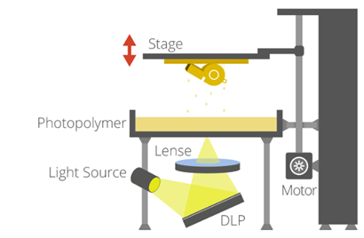
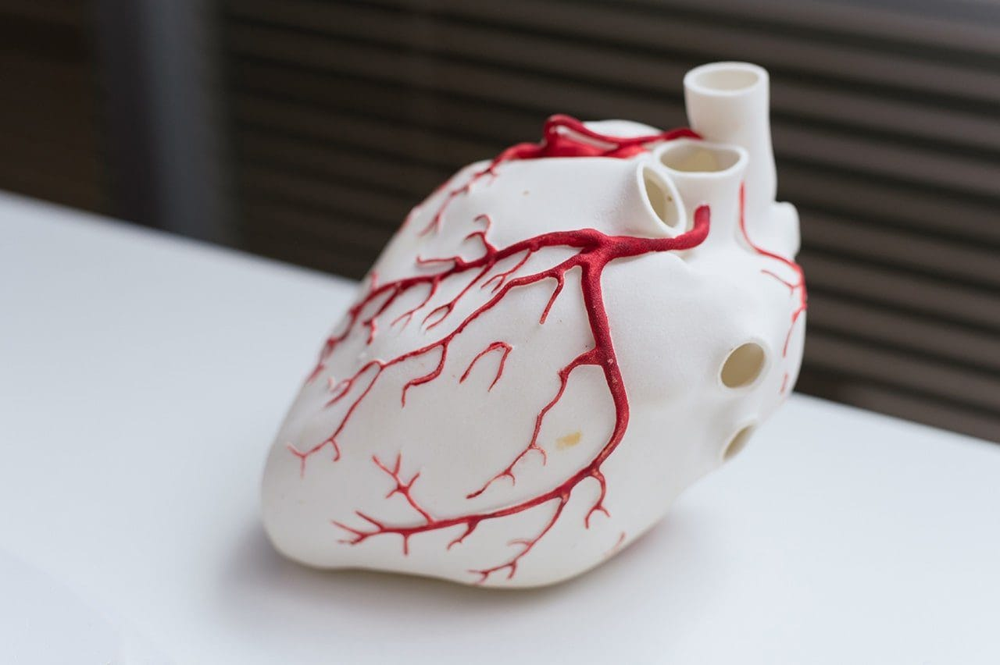
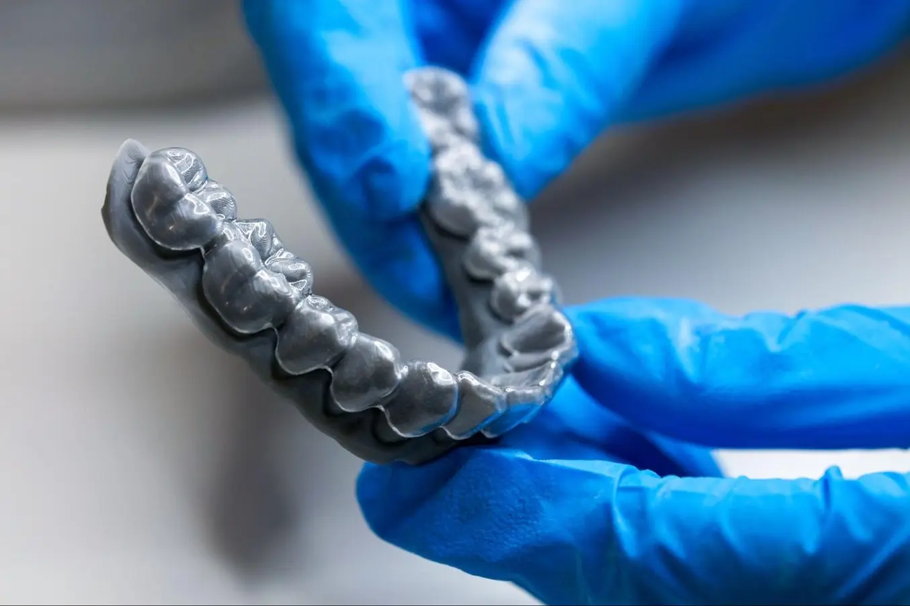

# SLA 3D printers in medical applications

Stereolithography Apparatus (**SLA**) is a high-precision 3D printing technique. The printed object is formed from a liquid resin. Although the resin itself might have health-adverse effects, SLA prints have found use in many places, including medical applications.

### SLA printing: How does it work?

You might know about the other type of 3D printing — [filament deposition (FDM) printing](https://www.hubs.com/knowledge-base/what-is-fdm-3d-printing/). Both FDM and SLA print the result out of layers of printed material. But this is where the similarities end.

SLA printers create the solid layers from a liquid photopolymer resin. SLA [printing chemistry is quite interesting](https://blog.prusa3d.com/everything-you-always-wanted-to-know-about-resins-and-safety-sla-printing-but-were-afraid-to-ask_70758/), but the short of it is that the liquid resin solidifies when exposed to a certain type (wavelength) of UV light. After the resin forms a solid layer, the build platform rises or lowers until the final object is printed.

<figure><figcaption></figcaption></figure>

### Medical applications

Stereolithography (SLA) 3D printing has gained attention in medicine due to its precision nd the ability to create complex geometries with a lot of detail. These attributes make SLA suitable for medical applications, from surgical planning and prosthetics to dental restoration.

One of the most impactful uses of SLA in healthcare is in the fabrication of patient-specific anatomical models. Derived from CT or MRI scans, these models enable surgeons to plan and simulate procedures with greater accuracy, reducing intraoperative uncertainty and enhancing patient outcomes. For example, SLA-printed models of vascular structures or bone fractures can help surgeons rehearse complex surgeries or determine feasibility before starting the surgery.

SLA printing is also used in medical education. SLA printed models can mimic various tissues, which makes for more realistic training tools for medical students. Furthermore, SLA's precision allows for the creation of micro-scale objects like neuron channels or vascular networks, which are great for specialized training.

<figure><figcaption></figcaption></figure>

Dentistry is one of the earliest adopters of SLA technology. SLA found its use in several applications like creating crowns, bridges, aligners, retainers, and surgical guides. High accuracy of SLA prints ensures better-fitting dental appliances. Additionally, the speed of SLA printing allows for quick restorations.

<figure><figcaption></figcaption></figure>

As material science advances and more medical-grade resins become available, the role of SLA in medicine is expected to expand. Its capacity for rapid prototyping, customization, and high fidelity makes it an indispensable tool in the movement toward personalized and precision medicine. Combined with digital imaging and AI-driven design, SLA is set to redefine how medical solutions are developed, tested, and implemented.
